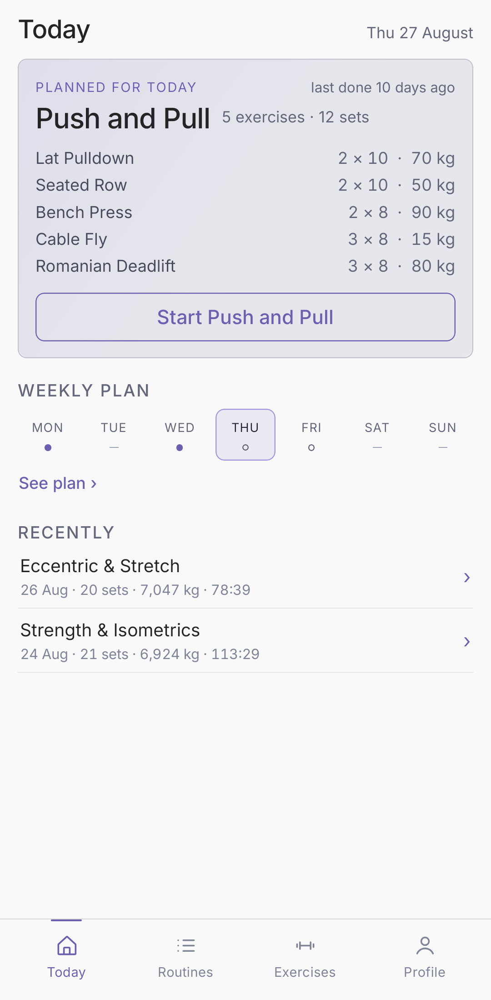
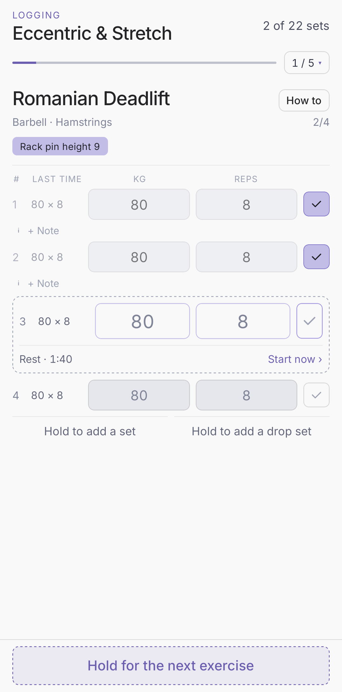
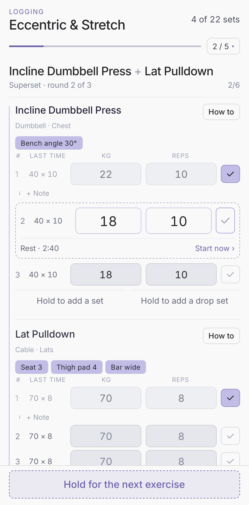
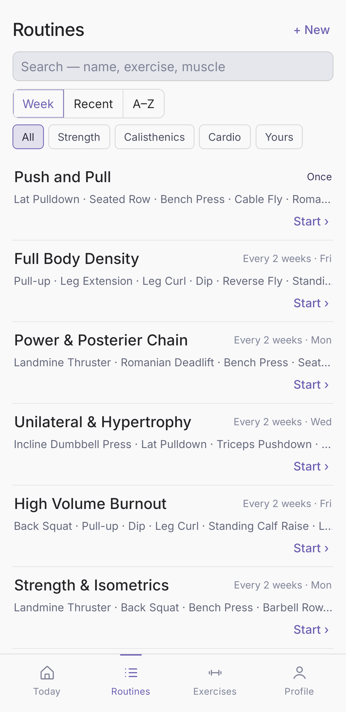
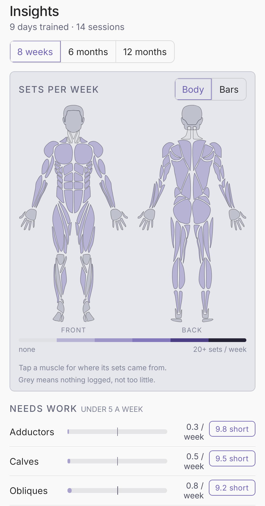
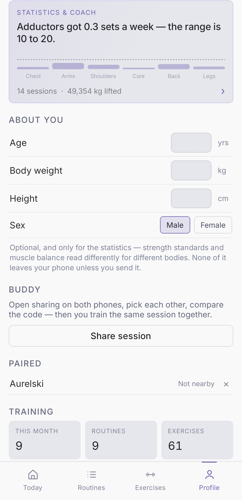

# Spotter

An Android workout logger, built with Expo and React Native. Plan a week, start
the day's routine, and type your numbers set by set while you're standing at the
machine. Two phones can pair over the local radio and train the same session
together — which is where the name comes from: a spotter is whoever is there for
your set, and here that is both the app and the person on the other phone.

Everything stays on the phone. There is no account, no server and no analytics;
the only thing that ever leaves is a backup file you export yourself, or a
prompt you choose to send to a chat AI.

**Android · Expo SDK 54 · React Native 0.81 · TypeScript · English and German**

> **Source-available, not open source.** The code is here to be read; it is not
> licensed for use or redistribution. See [Licence](#licence).

The app grew out of the **Workout Diary v2** design in Claude Design — the
Nocturne design system, dark by default, Inter, a blurple accent — with a light
mode, six colour themes, statistics and an AI coach added on top of it.

The icon is two weight plates overlapping, the lens where they meet lit: your
session, your buddy's, and the part you do together. It isn't a drawing —
`npm run icons` renders every asset from the geometry and the palette in
`src/design/tokens.ts`, so a colour change can be followed through.

## Screenshots

|                                       |                                               |                                                 |
|:-------------------------------------:|:---------------------------------------------:|:-----------------------------------------------:|
|        |      |  |
|   The day's plan and the week ahead   |         Two fields and a tick per set         |               A pair, back to back              |
|  |  |              |
|   Search by name, exercise or muscle  |        Sets per muscle, against a range       |           Your figures, and your buddy          |

Shown in light mode; the design is dark by default, with six colour themes.
[`screenshots/`](screenshots/) has the rest.

## What it does

- **Log a workout.** One exercise per screen, two fields and a tick per set.
  Last time's numbers sit greyed beside each row — tap to copy them in, or just
  tick and they fill themselves. A number cell is also a slider: touch it and
  slide to step it, so most sets never need the keyboard. Every logged set
  starts a rest timer that survives a locked screen and arrives as a
  notification if you have wandered off.
- **Sets that aren't only reps.** An exercise measures load × reps, weight ×
  seconds for a hold, km × minutes for a run, or minutes alone — so a Saturday
  five-a-side and a bench press share one screen. Drop sets stack under the set
  they came off; a routine can pair two exercises into a superset, and neither
  earns a rest until the pair is done.
- **Say what you thought of a set.** A verdict — heavier, lighter, that was the
  weight — plus optional words, read back at the top of the exercise the next
  time you stand in front of it.
- **Plan with dated rules.** Weekly, every *n* days, one-offs, per-weekday, all
  on one calendar, with skips for the day you swap something out. An optional
  reminder at a time you set.
- **Routines.** Yours, searchable by name, exercise or muscle group in either
  language, over a shelf of fifteen seeded ones you can add and edit.
- **An exercise library.** Fifty-three seeded exercises across twenty muscle
  groups and five equipment kinds, all editable, plus your own — with how-to
  notes, your own photos, and a machine-setup note for the pin you always
  forget.
- **Insights.** Sets per muscle per week read against a 10–20 range, on a body
  heatmap and on bars; a push:pull ratio; strength standards for the four lifts
  that have published tables; volume over time. None of it is stored — it is all
  derived from what you logged.
- **An AI coach with no AI in it.** The app writes a prompt from your diary, you
  send it to whichever chat AI you like, and it reads the answer back — pasted,
  shared into the app, or tapped as a file — into a preview you import or
  discard.
- **Train with a buddy.** Two phones pair over Google Nearby Connections
  (Bluetooth and Wi-Fi Direct, no network involved), sync their libraries, and
  run one session together — whose set it is, who goes first, live progress both
  ways.
- **Backups.** Export the durable slice to a file; restore it wholesale, or
  merge in only what this phone is missing.

## Running it

Requirements: Node 20+, a JDK 17, and the Android SDK (Android Studio is the
easy way). Then:

```bash
npm install
```

Two ways to run it, and both stay supported:

- **Standalone / dev build** — the real app, with the real buddy radio:

  ```bash
  npm run android
  ```

  That runs `expo run:android`: Gradle builds the native project and installs it
  on a connected device. `android/` is generated and gitignored, so the first
  run does a prebuild, and `android/local.properties` is where the SDK location
  lands.

  A shareable release APK comes from

  ```bash
  npm run build:apk
  ```

  which Gradle-builds `assembleRelease` and drops
  `_builds/spotter-<date>-<hash>.apk`. To put it on a phone hanging off the USB
  cable:

  ```bash
  npm run install:apk
  ```

  It takes the newest APK in `_builds/`, installs it over the existing one
  (`adb install -r`, so the diary on that phone survives) and launches it.
  Emulators and adb-over-wifi targets are ignored — this is the cable only.
  `-- --build` builds a fresh APK first, `-- -s <serial>` picks between two
  connected phones, `-- --no-launch` just installs. Signature mismatches are
  reported rather than resolved: the uninstall that would fix one also erases
  that phone's history.

- **Expo Go** — JS-only iteration, mock buddy radio:

  ```bash
  npm start
  ```

  Scan the QR code from Expo Go. The three local native modules aren't available
  there, so the buddy radio falls back to a mock transport, the foreground
  service is a no-op, and shared-text intake is inert. Nothing crashes: every
  native import goes through an optional bridge.

There is no Play Store listing — the app is sideloaded. iOS config is untouched
but unexercised.

On Windows these also exist as double-clickable batch files in the repo root:
`start-app.bat`, `start-emulated.bat`, `start-phone.bat`, `build-apk.bat` and
`install-apk.bat`.

### Checks

All three pass before a commit:

```bash
npm run typecheck
```

```bash
npm run lint
```

```bash
npm run test
```

Vitest runs over the pure modules in `src/data` — the storage migrations and
backup merge, the AI coach's parse/resolve seam, the muscle-contribution
arithmetic, the statistics and the strength standards. Plain Node, no React
Native harness; `npm run test:watch` while working on any of them.
`npx expo export --platform android` catches what only breaks at bundle time.

### Testing the buddy features without two phones

Real Nearby Connections needs Bluetooth hardware, which emulators don't have.
The sim radio replaces just the transport — a WebSocket to a relay on the dev
machine — while every line of app code above the native module runs for real:
discovery, the pairing code, sync, shared workouts, reconnects.

```bash
npm run start:emu
```

One command: boots up to two emulators (`-- 1` for just one), opens the relay in
its own console window, and starts Metro with the sim enabled — then press `a`
to open the app on an emulator, `shift+a` to pick which. Everything is
skip-if-already-there, so rerunning it reuses running emulators and the open
relay. It needs the Android emulator plus AVDs installed once; the script prints
how.

To have a real phone be one of the two, put it on the USB cable and run

```bash
npm run start:phone
```

which is the same script with `--phone`: the phone becomes one of the two
instances, so only one emulator is booted. `-- 0` boots none (two cabled phones
are the pair), `-- -s <serial>` singles out one of two. The phone is opt-in
rather than detected, because a plain `start:emu` must not take over a phone
that happens to be tethering.

Everything goes down the cable through `adb reverse` — no LAN address, no route,
no firewall rule, which is what lets it keep working while the PC is online
through that same phone's tethering. Toggling tethering re-enumerates USB and
drops the forwards, so they are re-armed every few seconds rather than set once.

The phone runs the app in Expo Go here, not the installed Spotter: where the
native module exists the real radio always wins, and an emulator has no
Bluetooth to answer it. Expo Go keeps its own storage, so that instance is a
scratch diary and the real one is untouched.

When the instances are running but showing stale code, put them back on the
current sim-radio bundle with

```bash
npm run update:emu
```

which replaces any Metro holding port 8081 with a fresh sim-enabled one and
cold-restarts Expo Go on every emulator so it refetches the JS — a stale Metro
keeps the port and serves old code otherwise, silently. `-- --phone` includes
the cabled phone.

Without emulators the two halves also run by hand — the relay plus a sim-enabled
Metro, with the app in Expo Go on one or two phones:

```bash
npm run buddy-relay
```

```bash
npm run start:sim
```

Any combination of instances works. Each appears in the others' share sheet
exactly as a real phone would; pair them with the code as usual. The relay
derives nothing from the app: killing it (or pressing `d`+Enter in its terminal)
severs the link mid-session, which is the easy way to exercise the link-lost and
reconnect paths.

`EXPO_PUBLIC_SIM_RADIO` is inlined at bundle time: plain `npm start` never
includes the sim, and release builds ignore it entirely. On a device where the
native module exists, the real radio always wins.

### Why SDK 54 and not the latest

Expo Go supports exactly one SDK at a time, and the Play Store won't serve a
newer Expo Go than 54.0.8 to the oldest phone this is developed against — so the
project is pinned to SDK 54 to match. The app itself only needs Android 7.0;
it's Expo Go that's fussy, not the app.

The dev build means that ceiling no longer hard-blocks an upgrade — it would
just cost the Expo Go workflow, which is still the fast path for JS iteration.

### What the rename didn't touch

The app used to be called Workout Diary. Two identifiers still say so, and both
are load-bearing — they address existing data rather than describe the app, so
renaming them would quietly throw that data away:

- **`android.package`** is `com.calvinkohl.workoutdiary`, not the tidier
  `com.calkoh.spotter`. It is the app's identity to Android. Change it and the
  next install lands *beside* the old app instead of over it, with an empty
  diary, while the real history stays in the old package's storage.
- **`STORAGE_KEY`** in `workout-store.tsx` is `workout-diary/v4`. Same story one
  level down: rename the key and every logged session becomes unreachable and
  the app reads as a first run.

Neither is visible anywhere in the UI — the launcher shows `expo.name`.

## How it's built

```
src/
  app/            expo-router routes — root layout, (tabs) group, intent seam
  components/     shared UI, plus overlays/ for the sheets and full-screen panels
  design/         tokens.ts and ui.tsx — the Nocturne design system, ported
  data/           library, i18n, and the pure modules: plan, stats, coach, backup…
  store/          workout-store.tsx — all app state and its mutators
  hooks/
modules/          local native modules: nearby radio, session service, share text
plugins/          config plugins (release signing, build tools)
scripts/          icons, builds, the emulator harness, licence notices
```

Four things carry most of the weight:

- **One store.** `src/store/workout-store.tsx` holds every piece of app state
  and its mutators, and names the durable slice in a `PERSIST` list that goes to
  AsyncStorage as one JSON blob. Adding state means adding it there, not in a
  screen.
- **One design system.** `src/design/tokens.ts` is the port of the design's
  `styles.css` — every colour, radius, spacing and animation timing in the app
  reads from it, and the six themes plus light mode are *derived* from that
  palette in OKLCH rather than authored beside it. Nothing is hardcoded at a
  call site.
- **Pure modules for anything that reasons.** `data/plan.ts`, `data/stats.ts`,
  `data/strength.ts`, `data/coach.ts`, `data/superset.ts` and `data/migrate.ts`
  take values and hand answers back — no store, no hooks, no colours, no
  strings. That is what makes them testable in plain Node, and it is the whole
  test strategy.
- **One dictionary.** Every user-facing string lives in `src/data/i18n.ts`, in
  English and German. User-named things (routines, custom exercises, groups,
  equipment) carry per-language names and resolve through the store.

Four tabs — Today, Routines, Exercises, Profile — plus a Plan screen reached
from Today. Starting a workout opens the logging screen over everything: one
exercise per screen, with the whole list, Add exercise and Finish behind the
`3 / 5` chip.

[AGENTS.md](AGENTS.md) is the long version — every rule that holds the codebase
together and every deliberate departure from the design, each one also commented
at its site.

## Releasing

```bash
npm run build:aab     # the App Bundle Play takes
npm run build:apk     # the APK to sideload
```

Both check that `app.json` and `package.json` state the same version (`npm run
version -- --fix` syncs them, `app.json` being the source of truth) and print
which key is about to sign. Release signing goes through
`plugins/with-release-signing.js`, because `android/` is generated and a
prebuild would otherwise restore the template's debug config. The key is *named*
by a gitignored `keystore.properties` (see
[keystore.properties.example](keystore.properties.example)) or by
`SPOTTER_KEYSTORE*` environment variables, and never stored here. With neither,
the build falls back to the debug key, says so, and names the artefact
`-debugsigned`.

Read [docs/release-signing.md](docs/release-signing.md) before the first real
release: switching keys costs an uninstall on every phone that already has the
app, and an uninstall costs that phone's diary.

## Docs

| File | What it is |
| ---- | ---------- |
| [AGENTS.md](AGENTS.md) | the working rules of the codebase, and the reason behind each |
| [docs/release-signing.md](docs/release-signing.md) | making the upload key, and the one-time migration off the debug key |
| [docs/privacy-policy.md](docs/privacy-policy.md) | English privacy policy |
| [docs/datenschutz.md](docs/datenschutz.md) | the German one |
| [docs/play-data-safety.md](docs/play-data-safety.md) | the Play Data safety answers, with the reason for each |
| [design/](design/) | the mockups and the research behind the screens that have no design |

## Contributing

This isn't taking contributions — the licence below doesn't permit derivative
work, and the app is built around one person's training. Questions and bug
reports are welcome as conversation; pull requests will be declined for the
licence rather than for their content.

## Licence

Proprietary — see [LICENSE](LICENSE). The repository is public to be read, not
to be reused: no licence is granted to use, copy, modify or redistribute any
part of it. Installing a copy of the app distributed by the author is permitted
for personal use, and that permission covers the application only.

The open-source components bundled into the app keep their own terms; the
notices they require are reproduced in
[THIRD-PARTY-NOTICES.md](THIRD-PARTY-NOTICES.md), regenerated with
`npm run licenses`.
